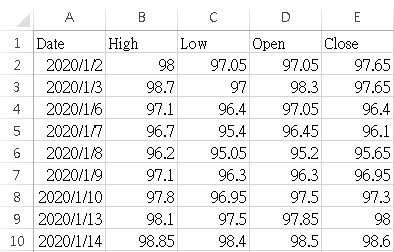
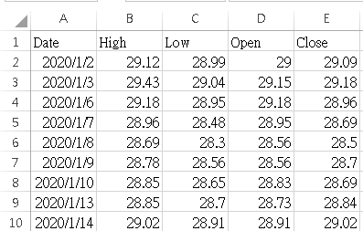
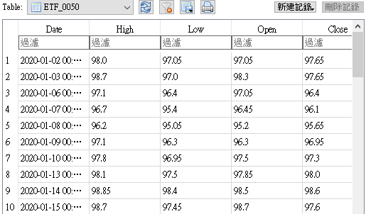
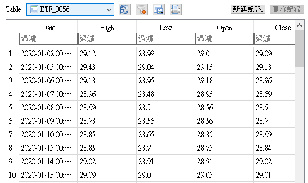
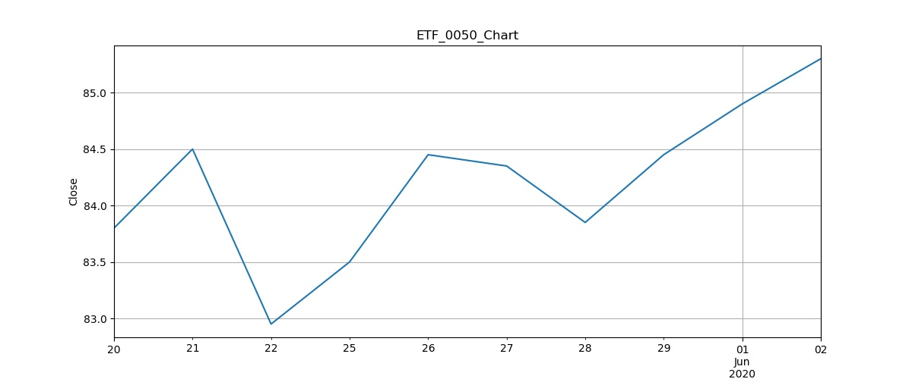
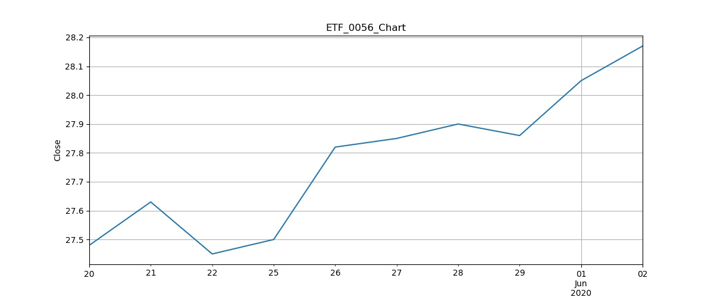
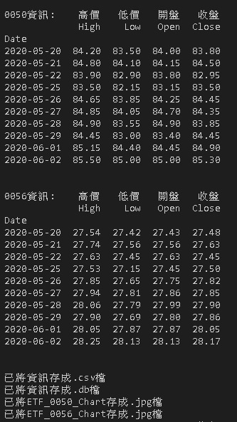

#### 安裝所需套件
`pip install -r requirements.txt`

#### 透過datetime套件來實作功能
- datetime.datetime(): 表示日期時間的類

#### 透過sqlite3套件來實作功能
- sqlite3.connect(): 連接資料庫

#### 透過pandas套件來實作功能
- pd.DataFrame(): 創立dataframe
- DataFrame.drop(): 從行或列中刪除指定的標籤
- DataFrame.tail(): 返回最後n行
- DataFrame.to_csv(): 將對象寫入csv文件
- DataFrame.to_sql(): 將存儲在DataFrame中的記錄寫入SQL數據庫

#### 透過matplotlib.pyplot套件來實作功能
- plt.savefig(): 保存圖片
- plt.show(): 顯示圖表

#### 透過pandas_datareader.data套件來實作功能
- web.DataReader(): 從網路中讀取數據

#### 程式說明
使用Python語言搭配SQLite資料庫開發，可依照使用者輸入日期範圍，

透過爬蟲程式來取得0050與0056股票資訊: 開盤、收盤、最高、最低...等，

最後將數據可視化呈現，並存為.csv、.db、.jpg檔。

#### 執行結果

